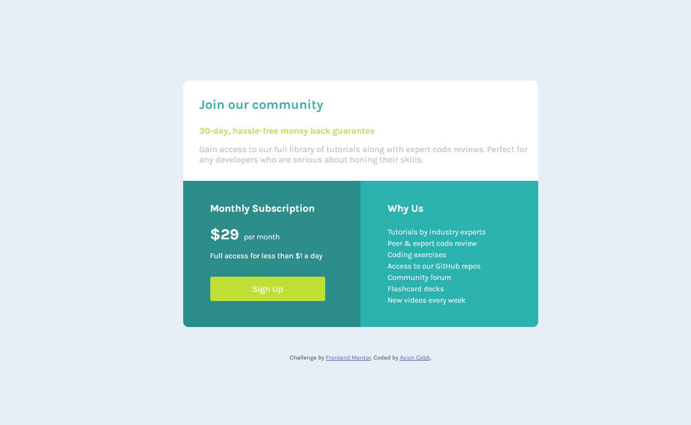

# Frontend Mentor - Single price grid component solution


## Table of contents

- [Overview](#overview)
  - [The challenge](#the-challenge)
  - [Screenshot](#screenshot)
  - [Links](#links)
- [My process](#my-process)
  - [Built with](#built-with)
  - [What I learned](#what-i-learned)
  - [Continued development](#continued-development)
  - [Useful resources](#useful-resources)
- [Author](#author)
- [Acknowledgments](#acknowledgments)

## Overview

Produced a simple pricing table that could be utilized.  

### The challenge

- Build out the pricing component to the designs provided.

- Create a hover state on desktop for the Sign Up call-to-action

### Screenshot



### Links
- [Challenge](https://www.frontendmentor.io/challenges/single-price-grid-component-5ce41129d0ff452fec5abbbc)
- [Solution](https://github.com/AvionShea/priceGrid_Frontendmentor)
- [Live Site](https://price-grid-frontendmentor.vercel.app/)

## My process

Looking at the image provided, I divided the picture into several areas. During this phase, I determine which HTML elements would be the most useful for a project. Sections, headings, paragraphs, spans, divs, unordered lists and footer element(tags) were the HTML elements/tags that I felt would be the most beneficial. From there, I selected the HTML file and renamed or created the appropriate elements that would be needed to create the price grid areas. Afterwards, I created the CSS file and linked, both, the CSS and fonts that I would be using to the HTML file.

### Built with

- Semantic HTML5 markup
- CSS custom properties
- CSS Floats

### What I learned

- Box-shadow property

I particularly proud of the button that I made. It's simple, but was done without help except from the MDN when I couldn't figure out the box-shadow.
```css
.signUp-btn{
    height: 45px;
    width: 65%;
    background: hsl(71, 73%, 54%);
    text-align: center;
    margin: 30px 0 0 50px;
    padding-top: 10px;
    border-radius: 3px;
}

.signUp-btn:hover{
    box-shadow: 1px 5px 8px black;
    cursor: pointer;
}
```

### Continued development

Things I will continue to focus on:
- CSS positions
- CSS flexbox
- GitHub

### Useful resources

- [MDN](https://developer.mozilla.org/en-US/) - Helped with CSS questions I had while completing this. Give explanations and examples. Great resource for all.

## Author

- GitHub - [AvionShea](https://github.com/AvionShea)
- LinkedIn - [Avion Cobb](https://www.linkedin.com/in/avion-cobb/)
- Twitter - [@Avion_Cobb](https://www.twitter.com/Avion_Cobb)
- Frontend Mentor - [@AvionShea](https://www.frontendmentor.io/profile/AvionShea)
- Website - [Avion Cobb](https://avionshea.github.io/)